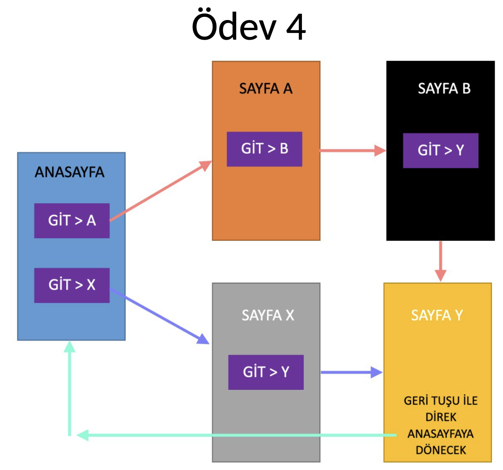

# FragmentTransition

## Description
FragmentTransition is an Android application that demonstrates the transition between fragments within the same activity. It provides an example of how to handle the back press button effectively in Android applications.

## Features
- Transition between fragments.
- Handling the back press button in fragment transitions.

## Technologies Used
- Kotlin
- Android SDK with Compile SDK version 34
- AndroidX libraries
- Material Design components

## Installation
To get started with FragmentTransition:
1. Clone or download this repository.
2. Open the project in Android Studio.
3. Ensure your environment includes Android SDK version 34, available through Android Studio's SDK Manager.
4. Build the project and run it on an Android device or emulator that supports API level 24 or higher.

## Usage
Explore the app to see how fragment transitions are handled and how the back press button functionality is implemented in a multi-fragment setup.

## Navigation Flowchart

This flowchart illustrates the navigation paths between different fragments within the app. It also shows the handling of the back button to return directly to the homepage from SAYFA Y.

## License
This project is licensed under the MIT License - see the [LICENSE](LICENSE) file for details.

## Contributing
Contributions are welcome. Please open an issue first to discuss what you would like to change or add.

## Contact
For questions or collaborations, you can contact the repository owner.